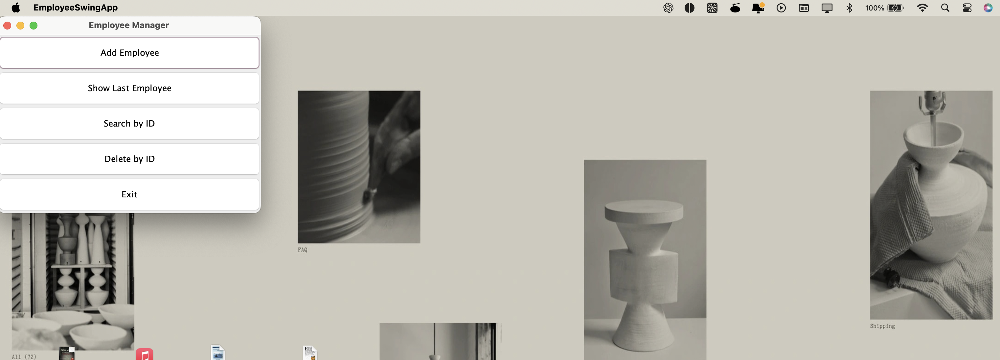

# 🚀 Employee Management System 🚀

A simple Java application that demonstrates core Object-Oriented Programming principles and GUI development with Java Swing.

## 📋 Project Overview

This Employee Management System allows users to:
- ✅ Add employee records with name, email, and employee ID
- 👁️ View employee details
- 🔍 Search for employees by ID
- 🗑️ Delete employee records
- 🔐 Check employee access levels based on ID

**The application is available in both Command Line Interface (App.java) and Graphical User Interface (EmployeeSwingApp.java) versions!**

## 🌱 Learning Journey

This project represents my personal journey of self-development with several key Java concepts:

- **🧩 Object-Oriented Programming**: Through this project, I gained hands-on experience with encapsulation (data hiding in GetEmp class), inheritance (extending classes), and composition (class relationships)
- **🖥️ Java Swing UI**: Learned to create interactive GUI applications with event-driven programming
- **📊 Data Structures**: Implemented LinkedList to understand dynamic data storage and management
- **🛡️ Exception Handling**: Applied try-catch blocks to handle unexpected situations gracefully
- **✓ Input Validation**: Developed skills in ensuring data integrity through validation rules

## 📁 Project Structure

- `GetEmp.java`: Core employee class with data validation and access control
- `accessHierarchy.java`: Determines employee access levels based on ID
- `checkerID.java`: Utility class for employee ID verification
- `EmployeeSwingApp.java`: GUI version of the application using Java Swing
- `App.java`: Console-based version of the application

ntern access

### Data Validation
- Email addresses must end with "@gmail.com"
- Various error handling for missing or invalid data

## Screenshots

> **Note:** Make sure to save the screenshots in your repository as screenshot1.png, screenshot2.png, etc., or update the image paths below to match your file structure.

### Employee Information Display

*This dialog shows the employee record with name "ueiuar", email "ryayaya@gmail.com", and ID "60420". The dialog displays key employee information in a clean, organized format, demonstrating how to present data to users in a Swing application.*

### Search Employee by ID

*The search dialog prompts users to enter an employee ID (shown with 60420 entered). This feature demonstrates how to create input dialogs and implement search functionality across a data structure using object-oriented principles.*

### Email Input Validation

*This input dialog captures email information with built-in validation. The system ensures emails end with "@gmail.com" through the validation logic implemented in the GetEmp class, showing the power of encapsulation and data validation.*

### Main Application Interface

*The main Swing interface features five clearly labeled buttons for different operations: Add Employee, Show Last Employee, Search by ID, Delete by ID, and Exit. This demonstrates the application of GridLayout and action listeners in Java Swing development.*

## Getting Started

1. Clone this repository
2. Compile all Java files: `javac *.java`
3. Run the GUI version: `java EmployeeSwingApp`
   OR
   Run the console version: `java App`

## Prerequisites

- Java Development Kit (JDK) 8 or higher
- Basic understanding of Java programming
- No additional libraries required - uses only standard Java libraries

## Development Opportunities

If you choose to use this project as a starting point for your own development, you might consider:

- Adding database connectivity with JDBC for persistent storage
- Implementing more advanced search capabilities
- Creating a more sophisticated UI with additional Swing components
- Adding reporting features to generate employee summaries
- Implementing user authentication and role-based access control

## Reflections

This project has been instrumental in my growth as a Java developer. By creating a practical application that solves a real-world problem, I've deepened my understanding of OOP concepts and gained valuable experience with Java Swing. The challenges faced during development have helped me develop problem-solving skills that will be valuable in future projects.

Feel free to provide feedback or suggestions for improvement!
